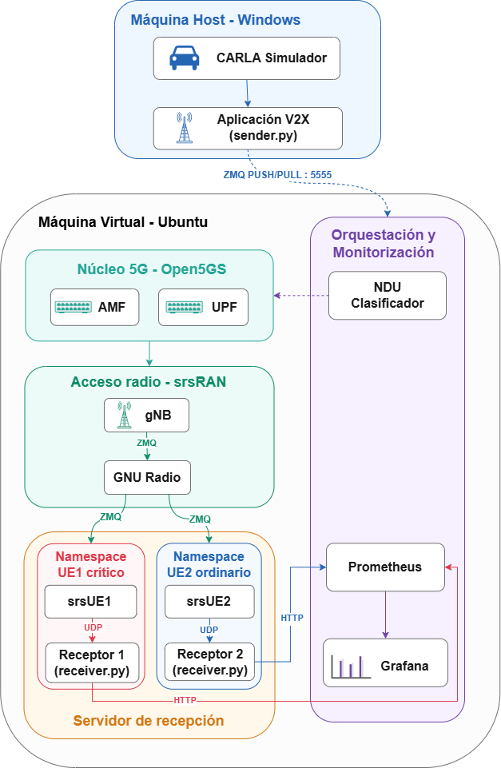
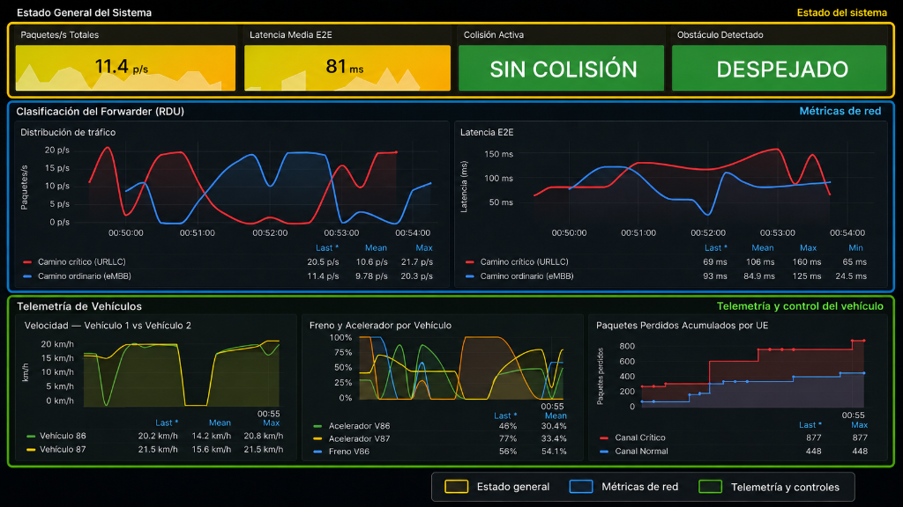
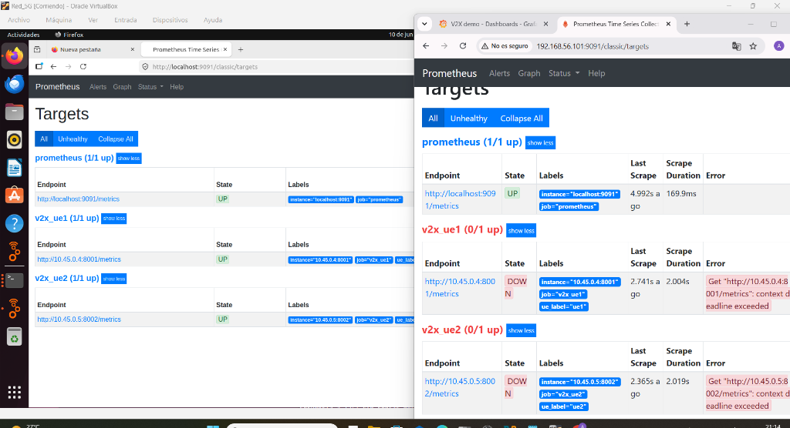
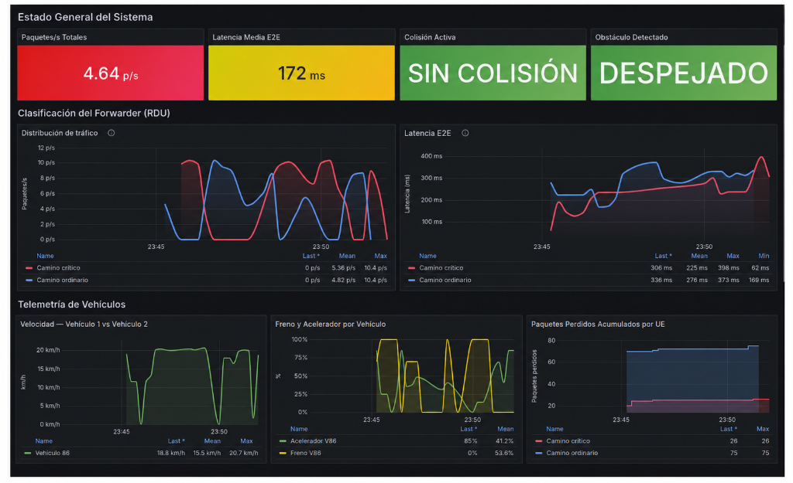

# Simulación E2E V2X sobre Redes Móviles 5G Sliced con CARLA, srsRAN y Open5GS

[](https://carla.org/)
[](https://github.com/srsran/srsRAN_Project)
[](https://open5gs.org/)
[](https://prometheus.io/)
[](https://grafana.com/)
[](https://www.python.org/)

Este repositorio contiene la entrega definitiva del proyecto de **Simulación de Comunicaciones Vehiculares Extremo a Extremo (E2E) V2X (Vehicle-to-Everything) sobre una Red Móvil 5G** emulada. 

La plataforma integra el simulador de conducción realista **CARLA** (ejecutado en Windows) con una red móvil 5G completa con segmentación de red (**Network Slicing**) utilizando **srsRAN**, **Open5GS** y **GNU Radio** (ejecutados en una Máquina Virtual Ubuntu). Todo el sistema es monitorizado en tiempo real mediante métricas expuestas a **Prometheus** e ilustradas en un panel de control personalizado de **Grafana**.

---

## Arquitectura General del Sistema

La comunicación cruza el entorno físico y virtual del host (Windows) y la Máquina Virtual (Ubuntu) a través de una red local adaptada (Host-Only Network), mapeando el flujo de datos según el siguiente esquema de arquitectura:



---

## Panel de Control de Grafana (Monitorización en Tiempo Real)

El panel monitoriza la velocidad de los vehículos, los estados de los mandos físicos (acelerador/freno), detección de colisiones, latencia de ida y vuelta (E2E), paquetes recibidos por segundo y pérdidas acumuladas.



---

## Estructura del Directorio y Descripción de Archivos

El proyecto se encuentra organizado de forma modular en los siguientes directorios especializados:

```
├── core-5g/               # Configuración Core Open5GS
├── srsran/                # Configuración Antena gNB y Terminales srsUE
├── gnuradio/              # Puente de canal de radio ZMQ multipunto
├── v2x-app/               # Scripts de envío, recepción y enrutamiento V2X
├── monitoring/            # Dashboards y targets de Prometheus/Grafana
├── host-setup/            # Ficheros de soporte para Windows
└── launch.sh              # Script orquestador principal
```

### Componentes e Infraestructura

| Directorio | Archivo | Descripción |
| :--- | :--- | :--- |
| **[`v2x-app/`](v2x-app/)** | **[`sender.py`](v2x-app/sender.py)** | Cliente Python conectado a la API de CARLA. Recupera las variables físicas del vehículo, codifica la información en formato **ASN.1 uPER** y la envía a la VM mediante **ZeroMQ PUSH**. |
| | **[`receiver.py`](v2x-app/receiver.py)** | Script receptor ejecutado en el namespace del UE. Escucha las tramas UDP en el puerto 5006, las decodifica, calcula latencias extremo a extremo y las exporta a Prometheus. |
| | **[`forwarder.py`](v2x-app/forwarder.py)** | Router clasificador de rodajas (slices). Recibe la telemetría ZMQ y la encamina dinámicamente a través del namespace del **UE1 (URLLC - Canal Crítico)** o del **UE2 (eMBB - Canal Normal)**. |
| | **[`v2x.asn`](v2x-app/v2x.asn)** | Esquema sintáctico estándar ASN.1 que modela el mensaje binario optimizado `VehicleMessage`. |
| **[`core-5g/`](core-5g/)** | **[`amf.yaml`](core-5g/amf.yaml)** / **[`smf.yaml`](core-5g/smf.yaml)** / **[`upf.yaml`](core-5g/upf.yaml)** | Configuraciones críticas del Core 5G de Open5GS (Gestión de acceso/movilidad, sesiones e interfaces GTP-U). |
| | **[`descargar_open5gs.txt`](core-5g/descargar_open5gs.txt)** | Guía rápida de comandos de instalación y arranque para Open5GS. |
| **[`srsran/`](srsran/)** | **[`gnb_zmq.yaml`](srsran/gnb_zmq.yaml)** / **[`gnb_zmq.yml`](srsran/gnb_zmq.yml)** | Archivos de configuración de la antena base 5G FDD (gNodeB de srsRAN Project) emulando radio sobre ZMQ. |
| | **[`ue1_zmq.conf`](srsran/ue1_zmq.conf)** / **[`ue2_zmq.conf`](srsran/ue2_zmq.conf)** | Ficheros de configuración de los terminales móviles srsUE (SIM virtual, bandas de frecuencia, etc.). |
| **[`gnuradio/`](gnuradio/)** | **[`multi_ue_scenario.grc`](gnuradio/multi_ue_scenario.grc)** / **[`multi_ue_scenario.py`](gnuradio/multi_ue_scenario.py)** | Esquema gráfico y ejecutable en GNU Radio que emula el medio físico de transmisión de radiofrecuencia (RF) por ZMQ. |
| **[`monitoring/`](monitoring/)** | **[`prometheu_v2x.yml`](monitoring/prometheu_v2x.yml)** | Configuración del scraper de Prometheus para automatizar el descubrimiento de las IPs de los terminales 5G. |
| | **[`v2x_dashboard.json`](monitoring/v2x_dashboard.json)** | Cuadro de mando exportable listo para Grafana. |
| **[`host-setup/`](host-setup/)** | **[`fix_tdr_delay.reg`](host-setup/fix_tdr_delay.reg)** | Parches del Registro de Windows para incrementar el `TdrDelay` a 60 segundos, solucionando los cuelgues del editor de CARLA UE4. |
| **Raíz (`/`)** | **[`launch.sh`](launch.sh)** | Script bash orquestador del sistema. Se encarga de instanciar namespaces, levantar gNB, srsUEs, GNU Radio, configurar enrutamientos y actualizar Prometheus de forma automática. |

---

## Guía de Despliegue y Ejecución

Sigue detalladamente el orden que se describe a continuación:

### 1. Preparación en Windows (CARLA)
1. Abre el proyecto `CarlaUE4` en Unreal Engine 4 o lánzalo en modo compilado.
2. Pulsa en **Play** para iniciar el entorno de simulación.
3. Abre una consola cmd y genera los vehículos controlados por IA:
   ```cmd
   python C:\carla\PythonAPI\examples\generate_traffic.py -n 10
   ```

### 2. Arranque de la Red 5G en Ubuntu (VM)
1. Accede al directorio del proyecto y dale permisos de ejecución al orquestador principal:
   ```bash
   chmod +x launch.sh
   ./launch.sh
   ```
2. Introduce la contraseña de administrador si se te solicita. Se levantarán terminales flotantes con el gNodeB, GNU Radio, los srsUEs e interfaces virtuales.
3. Comprueba que las consolas de los UEs terminan la negociación e indican:
   `Connected` y `PDU Session Establishment successful`.
4. Una vez los terminales se hayan asociado correctamente al Core 5G, **pulsa Enter en la terminal principal de `launch.sh`** para desplegar los scripts de recepción de telemetría.

### 3. Conexión y Envío de Telemetría (Windows)
1. Abre una terminal de comandos en Windows en `C:\v2x-5g`.
2. Lanza el transmisor apuntando a la IP de la Máquina Virtual de Ubuntu (por ejemplo, `192.168.56.101`):
   ```cmd
   python v2x-app/sender.py --host 192.168.56.101 --port 5555 --num-v2x 2
   ```
   *El script se asociará automáticamente a los vehículos de la simulación de CARLA, reposicionará el espectador de cámara para seguir al coche objetivo en tiempo real y enviará la telemetría.*

### 4. Acceso a las Gráficas
Desde el navegador de tu máquina host (Windows), puedes acceder a las siguientes URLs:
*   **Métricas de Prometheus**: `http://192.168.56.101:9091/classic/targets` (verifica que los targets `ue1` y `ue2` se muestran en verde **UP**).
*   **Dashboard de Grafana**: `http://192.168.56.101:3000` (inicia sesión con tus credenciales y abre el panel V2X).



---

## Demostración de Network Slicing y Congestión de Red (iperf3)

Para evaluar el beneficio de la segmentación de red (*Network Slicing*), es posible inducir tráfico pesado de fondo en el canal normal de datos eMBB (UE2) para comprobar cómo el canal de seguridad URLLC (UE1) mantiene sus requerimientos críticos de latencia y disponibilidad.

### 1. Iniciar el Servidor iperf3 en el namespace de UE2
En la terminal de la VM de Ubuntu, lanza el servidor iperf3 escuchando dentro de la red aislada de UE2:
```bash
sudo ip netns exec ue2 iperf3 -s
```

### 2. Inyectar Tráfico Masivo (eMBB) desde la Máquina Virtual
Desde una terminal normal de la VM de Ubuntu, genera tráfico masivo dirigido a la dirección IP asignada al UE2 (por ejemplo, `10.45.0.5`):
*   **Saturación Moderada (1 Mbps):**
    ```bash
    iperf3 -c 10.45.0.5 -b 1M -t 60
    ```
*   **Saturación Total / Colapso (5 Mbps):**
    ```bash
    iperf3 -c 10.45.0.5 -b 5M -t 60
    ```

### 3. Resultados Observados

El comportamiento de los canales se ilustra en la siguiente captura del dashboard bajo condiciones de congestión:



*   **Tráfico a 1 Mbps**: La latencia en el Canal Normal (línea azul de Grafana) comienza a experimentar jitter/oscilaciones y pequeños picos de pérdida de paquetes. El Canal Crítico (línea roja) permanece inmune e inalterado en torno a 120 ms de latencia.
*   **Tráfico a 5 Mbps (Saturación)**: El Canal Normal (UE2 - eMBB) colapsa por completo debido a la limitación física del canal ZMQ emulado. La tasa de paquetes recibidos cae a 0 y la pérdida de paquetes acumulada sube exponencialmente. Por el contrario, **el Canal Crítico (UE1 - URLLC) se mantiene activo de manera estable a ~9.4 paquetes/s con latencia de 120ms y 0% de pérdidas**, validando la efectividad del aislamiento de rodajas (Network Slicing) en el Core 5G de Open5GS.
